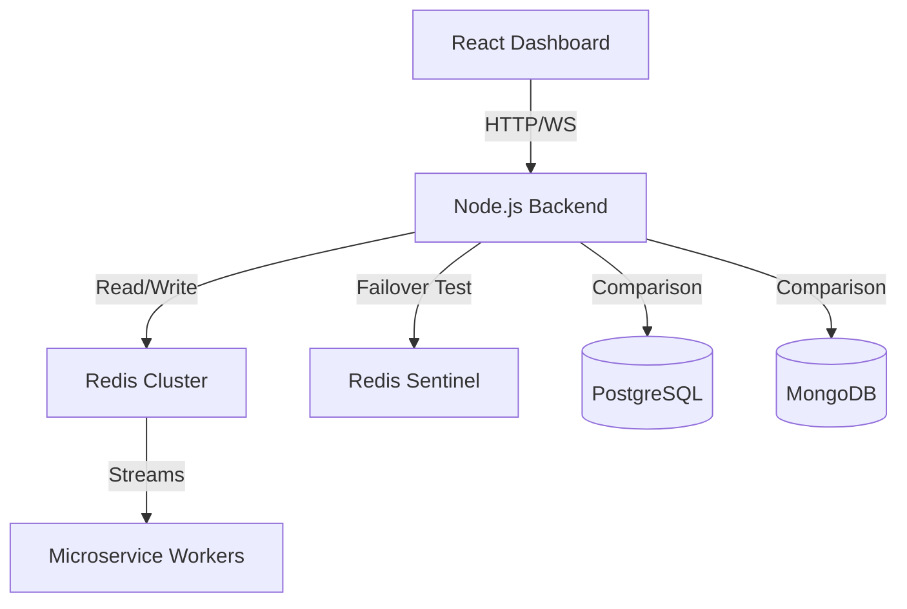
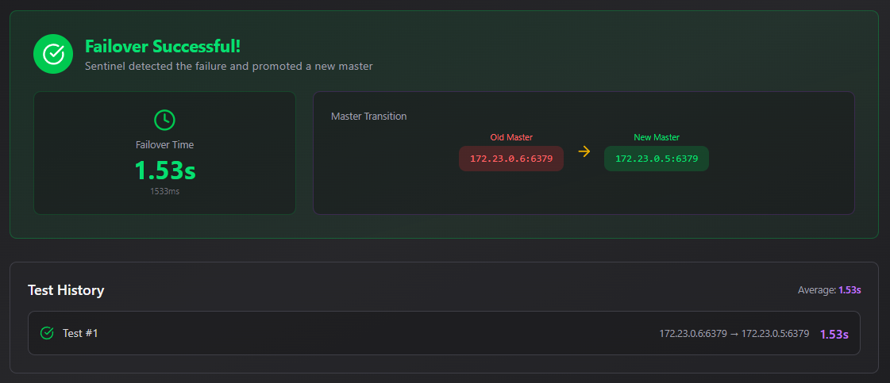

# Redis & Distributed Database Performance Engineering Dashboard


This project is an **interactive engineering playground** designed to benchmark, visualize, and analyze the behavior of **Redis** (Standalone, Cluster, Sentinel) against Traditional RDBMS (**PostgreSQL**) and NoSQL (**MongoDB**, **Memcached**) solutions under high-concurrency scenarios.

Unlike simple "Hello World" tutorials, this dashboard simulates **real-world distributed system patterns** like Event-Driven Microservices, Failover/Recovery, and Write Durability vs. Performance trade-offs.

## 🏗 System Architecture



## 📂 Project Structure

```text
.
├── backend          # Node.js API & Benchmarking Suite
├── frontend         # React/Vite Dashboard
├── cluster          # Redis Cluster Docker configs
├── sentinel         # Redis Sentinel Docker configs
├── benchmarking     # Multi-DB (Mongo, Postgres, Memcached) configs
└── assets           # Project screenshots and diagrams
```

## 🚀 Key Engineering Capabilities

### 1. Event-Driven Microservices Simulator (Redis Streams)
Simulates a complete e-commerce order pipeline using **Redis Streams** and **Consumer Groups**.
- **Real-time Visualization:** Tracks messages flowing through Inventory, Payment, Notification, and Analytics services.
- **Fault Tolerance:** Visualizes **PEL (Pending Entries List)** growth when consumers fail.
- **Consumer Lag Analysis:** Measures processing delays under burst loads and recovery time (RTO).

### 2. High-Precision Benchmarking (Network Compensated)
A custom benchmarking suite running on Node.js/Backend that measures:
- **P99 Latency:** Tail latency analysis for tiny, medium, and high payloads.
- **Network Overhead Compensation:** Automatically calculates and subtracts Docker network overhead (~0.6ms) to reveal raw database performance.
- **Concurrency:** Throughput comparison (Ops/Sec) under heavy concurrent connections (e.g., 50+ parallel clients).

### 3. High Availability & Data Safety
- **Cluster vs. Sentinel:** Live measurement of **Failover Conversion Time** (typically <1.5s in this optimized setup).
- **Durability Trade-offs:** Comparative analysis of **AOF (fsync)** vs. **Postgres WAL** vs. **MongoDB Journaling** regarding write speeds vs. data safety risks.
- **AOF Rewrite Impact:** Measures latency spikes on the main thread during background AOF rewriting.

## 🛠 Tech Stack

*   **Frontend:** React (Vite), TypeScript, TailwindCSS, Framer Motion, Recharts.
*   **Backend:** Node.js, Express, `ioredis` (Cluster/Sentinel aware), `pg` (Postgres), `mongodb` driver.
*   **Infrastructure:** Docker & Docker Compose (Custom networking for Cluster/Sentinel simulation).
*   **Databases:**
    *   Redis 7.x (Standalone, 3-Node Cluster, Sentinel Setup)
    *   PostgreSQL 15
    *   MongoDB 6
    *   Memcached

## 📊 Performance Insights (Screenshots)

### Microservices Pipeline & Failure Recovery

*Demonstrates throughput stability (16k+ ops/s) and zero data loss using Redis Streams Consumer Groups despite injected service failures.*

### Latency Comparison (P99 Analysis)

*Comparing tail latencies across Redis, Memcached, and Postgres. Shows how in-memory structures outperform disk-based WAL systems in high-concurrency reads.*

### Cluster Failover & Durability

*Live tracking of Sentinel promoting a new master in under 1.6 seconds, ensuring high availability.*

## ⚡ How to Run Locally

This project relies heavily on Docker networks to simulate a distributed environment.

### Prerequisites
*   Docker & Docker Compose
*   Node.js > 18.x

### 1. Start the Infrastructure
The project uses modular docker-compose files for different architectural simulations.

**For the Core & Microservices:**
```bash
docker-compose up -d
```

**For Cluster Simulation:**
```bash
cd cluster
docker-compose up -d
```

### 2. Start the Application

**Backend API:**
```bash
cd backend
npm install
npm run dev
```

**Frontend Dashboard:**
```bash
cd frontend
npm install
npm run dev
```

Visit `http://localhost:5173` to access the dashboard.

## 🧪 Methodology

*   **Latency Compensation:** To provide accurate benchmarks in a containerized environment (Windows/WSL2), a `measureNetworkOverhead()` function runs before tests (sending ping/pong packets) to subtract the baseline network round-trip time from the database operation time.
*   **Load Generation:** Benchmarks use `Promise.all` batches to simulate concurrent clients rather than sequential loops, ensuring maximum pressure on the database thread.

## 📜 License

MIT